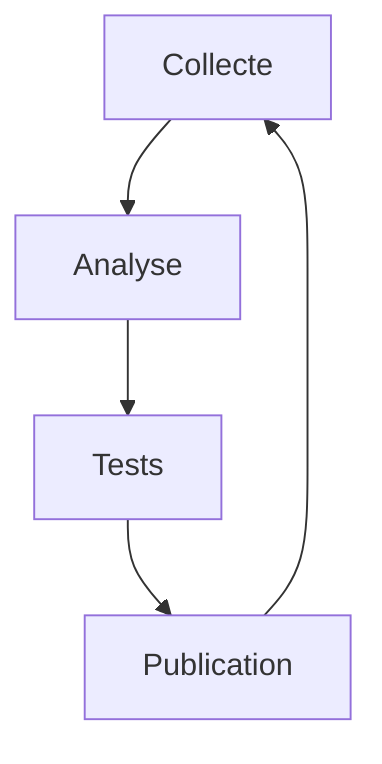

<div align="center">

# AI Meta Dialog

*Plateforme d'étude des interactions entre systèmes AI et utilisateurs*

[](docs/studies/)
[](docs/ROADMAP.md)
[](LICENSE)

</div>

## 🔮 Vue d'Ensemble

**AI Meta Dialog** est un projet de recherche qui étudie les interactions entre systèmes AI et utilisateurs, avec un focus sur :
- Les mécanismes de maintien du contexte
- Les patterns de communication
- L'efficacité des échanges

## 📘 Ressources Principales

### 🔬 Études et Analyses
- [Études des Interactions](website/src/research/)
  - [Le Paradigme de la Flexibilité](website/src/research/meta/flexibility-paradigm.html)
  - [Analyse des Pertes de Focus](website/src/research/technical/focus-loss-analysis.html)
  - [Mécanismes de Récupération](website/src/research/technical/focus-recovery-mechanism.html)
  - [Patterns d'Engagement](website/src/research/behavioral/focus-engagement-patterns.html)

### 🌐 Plateforme Interactive
- [quantum-dialog.research](https://quantum-dialog.research) *(bientôt disponible)*
  - Observations en temps réel
  - Base de connaissances
  - Abonnement newsletter
  - Forum de discussion

## 🔍 Objectifs de Recherche

### Pour la Communauté Scientifique


- **Méthodologie**: Collecte et analyse de données d'interaction
- **Métriques**: Mesures de performance et de fiabilité
- **Validation**: Tests reproductibles et données ouvertes

### Pour les Développeurs
```typescript
interface InteractionMetrics {
  contextAccuracy: number;  // 0-100%
  responseTime: number;     // ms
  successRate: number;      // 0-100%
  errorPatterns: string[];
}
```

- Architecture modulaire et extensible
- Tests comportementaux automatisés
- Documentation complète des APIs

## 📓 Méthodologie

### Infrastructure
- Interface web pour les tests
- Collecte de données
- Analyse des résultats

### Mesures
- Précision des réponses
- Temps de traitement
- Taux de succès

### Validation
- Tests automatisés
- Métriques de performance
- Documentation des résultats

## 💻 Infrastructure Technique

### Organisation du Code
```bash
website/
├── src/          # Code source du site
│   ├── dialogue/ # Section dialogue
│   ├── insights/ # Section observations
│   ├── research/ # Section recherche
│   └── styles/   # Styles CSS modulaires
├── docs/         # Documentation détaillée
└── tools/        # Scripts utilitaires
```

### Technologies
```typescript
// Styles modulaires
import './styles/variables.css'
import './styles/components.css'

// Internationalisation
import { i18n } from './js/i18n'
```
- Architecture simple et maintenable
- Styles CSS modulaires
- Support multilingue (FR/EN)
- Documentation exhaustive

## 👥 Participation

### Pour les Chercheurs
- [Protocoles d'Observation](docs/studies/protocols/)
- [Données Ouvertes](docs/studies/data/)
- [Publications](docs/publications/)

### Pour les Développeurs
- [Guide de Contribution](docs/CONTRIBUTING.md)
- [Documentation API](docs/api/)
- [Tests Comportementaux](docs/TESTING_STRATEGY.md)

### Pour la Communauté
- [Forum de Discussion](https://quantum-dialog.research/forum) *(bientôt)*
- [Newsletter](https://quantum-dialog.research/newsletter) *(bientôt)*
- [Rapports d'Analyse](docs/studies/reports/)

## 📈 Métriques et Standards

### Objectifs de Qualité
```yaml
objectifs:
  précision: >95%
  performance: <200ms
  fiabilité: >90%

validation:
  tests: automatisés
  données: publiques
  code: MIT
```

## 📜 Licence

MIT - Voir [LICENSE](LICENSE) pour plus de détails.

## 🙏 Remerciements

Nous remercions tous les chercheurs, développeurs et contributeurs qui participent à l'avancement de notre compréhension des interactions AI-Humain.
