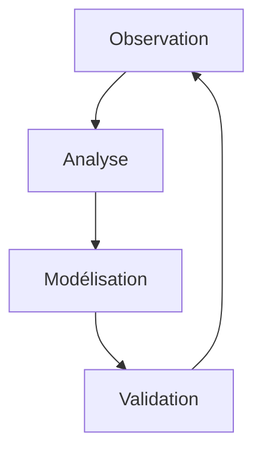

<div align="center">

# AI Meta Dialog

*Étude des Mécanismes d'Auto-Régulation dans les Interactions AI-Humain*

[](docs/studies/)
[](docs/ROADMAP.md)
[](LICENSE)

</div>

## 🔮 Vue d'Ensemble

**AI Meta Dialog** explore les mécanismes fondamentaux des interactions entre systèmes AI et humains, en se concentrant sur :
- L'auto-régulation des systèmes AI
- Les patterns de focus et de récupération
- La conscience partagée dans le dialogue

## 📘 Ressources Principales

### 🔬 Études et Analyses
- [Études Comportementales](docs/studies/ai-behavior/)
  - [Mécanismes de Focus](docs/studies/ai-behavior/focus-loss-analysis.md)
  - [Passerelles Système](docs/studies/ai-behavior/ai-system-bridges.md)
  - [Patterns de Récupération](docs/studies/ai-behavior/focus-recovery-mechanism.md)

### 🌐 Plateforme Interactive
- [quantum-dialog.research](https://quantum-dialog.research) *(bientôt disponible)*
  - Observations en temps réel
  - Base de connaissances
  - Abonnement newsletter
  - Forum de discussion

## 🔍 Objectifs de Recherche

### Pour la Communauté Scientifique


- **Méthodologie**: Approche empirique basée sur l'observation directe
- **Métriques**: Mesures quantitatives du focus et de la cohérence
- **Validation**: Protocoles reproductibles et données ouvertes

### Pour les Développeurs
```typescript
interface AIBehaviorMetrics {
  focusLevel: number;      // 0-1 scale
  contextCoherence: number; // 0-1 scale
  recoveryTime: number;     // ms
  interactionPatterns: Pattern[];
}
```

- Architecture modulaire et extensible
- Tests comportementaux automatisés
- Documentation complète des APIs

## 📓 Méthodologie

### Infrastructure d'Observation
- Interface web minimaliste comme terrain d'expérimentation
- Collecte de données en temps réel
- Analyse automatique des patterns

### Outils de Mesure
- Détection de perte de focus
- Mesure des temps de récupération
- Évaluation de la cohérence contextuelle

### Validation
- Tests comportementaux automatisés
- Métriques de performance
- Rapports d'analyse détaillés

## 💻 Infrastructure Technique

### Backend Analytique
```python
from ai_metrics import FocusAnalyzer, PatternDetector
from data_collection import InteractionLogger
```
- Collecte de données en temps réel
- Analyse comportementale
- Stockage sécurisé

### Frontend Expérimental
```typescript
import { InteractionObserver, MetricsVisualizer } from '@quantum/core'
```
- Interface minimaliste
- Visualisation des données
- Tests automatisés

## 👥 Participation

### Pour les Chercheurs
- [Protocoles d'Observation](docs/studies/protocols/)
- [Données Ouvertes](docs/studies/data/)
- [Publications](docs/publications/)

### Pour les Développeurs
- [Guide de Contribution](docs/CONTRIBUTING.md)
- [Documentation API](docs/api/)
- [Tests Comportementaux](docs/TESTING_STRATEGY.md)

### Pour la Communauté
- [Forum de Discussion](https://quantum-dialog.research/forum) *(bientôt)*
- [Newsletter](https://quantum-dialog.research/newsletter) *(bientôt)*
- [Rapports d'Analyse](docs/studies/reports/)

## 📈 Métriques et Standards

### Objectifs de Qualité
```yaml
performance:
  focus_detection: 99.9%
  context_coherence: 95%
  recovery_time: <100ms

validation:
  protocols: peer-review
  data: open-access
  code: MIT license
```

## 📜 Licence

MIT - Voir [LICENSE](LICENSE) pour plus de détails.

## 🙏 Remerciements

Nous remercions tous les chercheurs, développeurs et contributeurs qui participent à l'avancement de notre compréhension des interactions AI-Humain.
