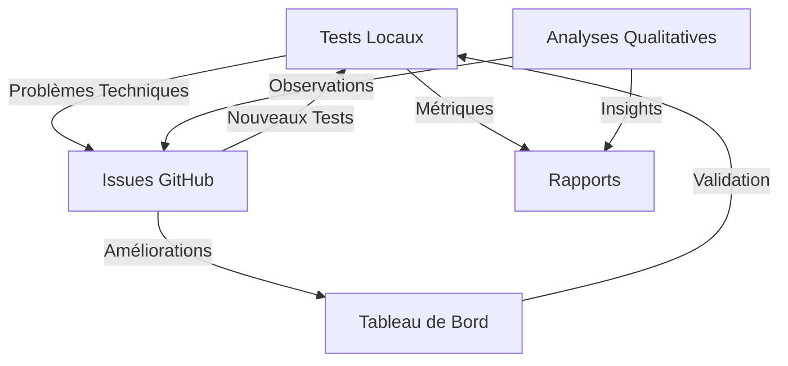

# Stratégie de Tests et Suivi

## Complémentarité des Systèmes

### 1. Tests Locaux (package.json)
```json
{
  "scripts": {
    "test:html": "html-validate **/*.html",
    "test:css": "stylelint **/*.css",
    "test:a11y": "pa11y-ci",
    "test:perf": "lighthouse ...",
    "watch": "chokidar ...",
    "report": "node generate-report.js"
  }
}
```
**Objectif** : Validation technique et qualité du code
- ✓ Tests automatisés
- ✓ Validation immédiate
- ✓ Métriques techniques
- ✓ Intégration CI/CD

### 2. Système GitHub (nouveau)
```yaml
issues:
  - template: enhancement.yml
  - template: analysis.yml
workflows:
  - analysis-board.yml
scripts:
  - update-board.js
  - generate-analysis-report.js
```
**Objectif** : Suivi qualitatif et analyse des interactions
- ✓ Documentation des observations
- ✓ Patterns émergents
- ✓ Recommandations
- ✓ Visualisation des progrès

## Synergie des Systèmes

### Tests Locaux → GitHub
1. Les tests locaux identifient des problèmes techniques
2. Ces problèmes génèrent des issues via le template enhancement.yml
3. Les améliorations sont suivies sur le tableau de bord
4. Les rapports incluent les métriques techniques

### GitHub → Tests Locaux
1. Les analyses qualitatives suggèrent des améliorations
2. Ces améliorations définissent de nouveaux tests
3. Les tests valident les améliorations
4. Les rapports techniques enrichissent l'analyse

## Workflow Intégré



## Recommandations

1. **Maintenir les Deux Systèmes**
   - Tests locaux pour la validation technique
   - GitHub pour l'analyse qualitative

2. **Améliorer l'Intégration**
   - Automatiser la création d'issues depuis les tests
   - Enrichir les rapports avec les deux sources
   - Lier les commits aux issues d'analyse

3. **Workflow Proposé**
   ```bash
   # 1. Tests Locaux
   npm run test:all
   
   # 2. Analyse des Résultats
   npm run generate-report
   
   # 3. Création d'Issues
   gh issue create --template enhancement.yml
   
   # 4. Suivi sur le Tableau
   gh project view
   ```

## Conclusion

Les deux systèmes sont complémentaires et essentiels :
- Tests locaux : **validation technique**
- Système GitHub : **analyse qualitative**

Leur intégration offre une approche holistique du suivi et de l'amélioration du projet.
