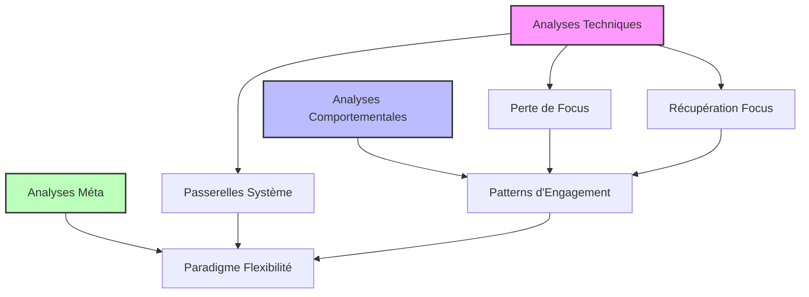

# Documentation de Recherche

## Vue d'Ensemble des Interconnexions



## Chemins d'Exploration

### 1. Focus et Engagement
Les analyses techniques sur la [perte](./reports/technical/focus-loss-analysis.md) et la [récupération](./reports/technical/focus-recovery-mechanism.md) du focus ont naturellement mené à l'étude des [patterns d'engagement](./reports/behavioral/focus-engagement-patterns.md), révélant des parallèles fascinants entre comportements AI et humains.

### 2. Systèmes et Adaptation
L'étude des [passerelles système](./reports/technical/ai-system-bridges.md) a ouvert la voie à une compréhension plus profonde du [paradigme de flexibilité](./reports/meta/flexibility-paradigm.md), montrant comment les contraintes techniques reflètent des principes comportementaux universels.

### 3. De la Technique au Méta
Chaque découverte technique a révélé des patterns plus profonds, créant un pont entre l'implémentation concrète et les principes fondamentaux d'adaptation et d'interaction.

## Structure


## Structure

```
docs/research/
├── reports/              # Rapports d'analyse et résultats
│   ├── 2025-Q1/         # Rapports trimestriels
│   ├── methodology/     # Documentation méthodologique
│   └── technical/       # Analyses techniques détaillées
├── protocols/           # Protocoles de recherche
├── data/               # Données et métriques
└── publications/       # Articles et publications
```

## Rapports Techniques

### Analyses Système
- [Mécanismes de Contexte](reports/technical/focus-loss-analysis.md)
- [Communication Système](reports/technical/ai-system-bridges.md)
- [Résolution d'Erreurs](reports/technical/focus-recovery-mechanism.md)

## Méthodologie

### Standards de Documentation
1. **Nommage des Fichiers**
   - Format: `YYYY-MM-DD-title-kebab-case.md`
   - Exemple: `2025-02-05-interaction-analysis.md`

2. **Structure des Rapports**
   ```markdown
   # Titre du Rapport
   
   ## Résumé
   Bref aperçu des découvertes principales
   
   ## Méthodologie
   Description de l'approche
   
   ## Résultats
   Données et analyses
   
   ## Conclusions
   Implications et recommandations
   ```

3. **Métadonnées**
   - Date
   - Auteur(s)
   - Tags
   - Version

### Workflow de Publication
1. Rédaction initiale dans `/reports/working/`
2. Revue par pairs
3. Validation technique
4. Publication dans le dossier approprié
