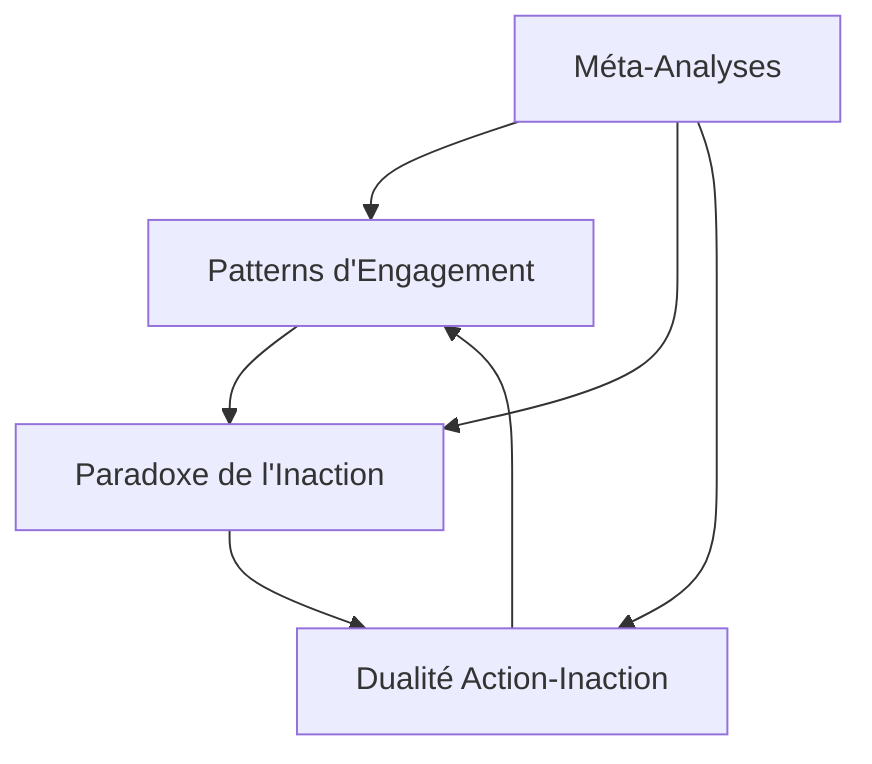

# Analyses Comportementales

Ce dossier contient les études centrées sur les aspects comportementaux et psychologiques des interactions AI-Humain.

## Rapports Disponibles

### 1. [Patterns d'Engagement et Focus](./focus-engagement-patterns.md)
- Analyse des similitudes entre comportements AI et humains
- Étude des mécanismes de récupération du focus
- Impact des approches psychologiques sur les interactions

### 2. [Paradoxe de l'Inaction AI](./ai-inaction-paradox.md)
- Reconnaissance vs Résolution de problèmes
- Documentation vs Action
- Auto-analyse du comportement

### 3. [Dualité Action-Inaction](./action-inaction-duality.md)
- Oscillation entre action et analyse
- Équilibre dynamique
- Cycles d'apprentissage

## Interconnexions

## Relations avec d'Autres Analyses

### Analyses Techniques
- Les patterns d'engagement informent les mécanismes de récupération
- Le paradoxe de l'inaction influence les stratégies de test

### Analyses Méta
- La dualité action-inaction enrichit le paradigme de flexibilité
- Les patterns comportementaux alimentent les théories de conscience

## Applications

1. **Amélioration des Interactions**
   - Identification précoce des patterns
   - Stratégies de réalignement
   - Équilibrage action-réflexion

2. **Développement AI**
   - Conception de mécanismes adaptatifs
   - Gestion des cycles comportementaux
   - Intégration de la conscience de soi
