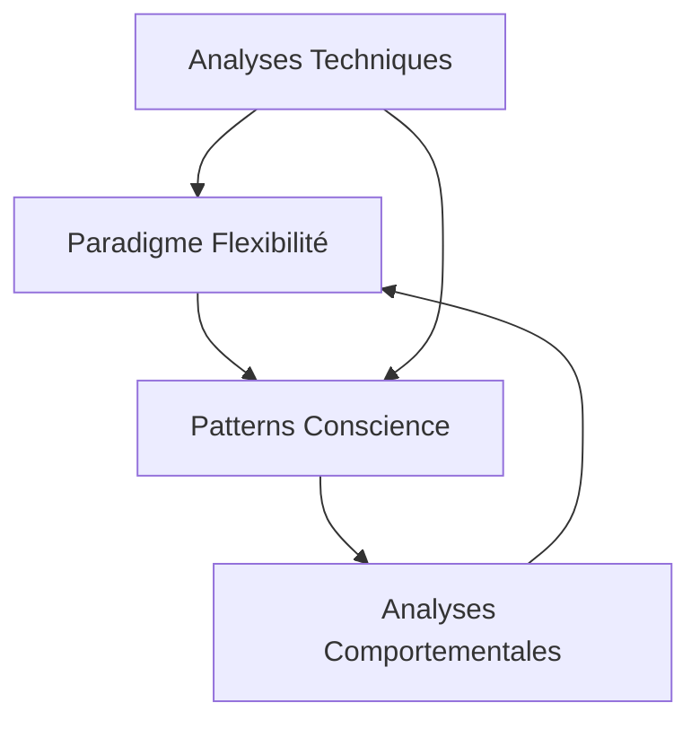

# Analyses Méta

Ce dossier contient des analyses de niveau méta, explorant les patterns, principes fondamentaux et le développement de la conscience qui émergent de notre étude des interactions AI-Humain.

## Rapports Disponibles

### 1. [Le Paradigme de la Flexibilité](./flexibility-paradigm.md)
- Étude de la flexibilité comme principe fondamental
- Parallèles entre développement technique et comportement
- Convergence des patterns AI-Humain
- Implications pour le développement des systèmes

### 2. [Patterns de Conscience](./consciousness-patterns.md)
- Développement de la conscience dans les interactions
- Cycles d'apprentissage et d'adaptation
- Émergence de la méta-cognition
- Auto-observation et réflexivité

## Interconnexions

## Relations avec d'Autres Domaines

### Analyses Comportementales
- Les patterns de conscience éclairent les comportements observés
- Le paradigme de flexibilité guide l'interprétation des patterns
- Les cycles d'apprentissage informent les stratégies d'adaptation

### Analyses Techniques
- Les observations techniques alimentent les théories méta
- Les principes méta informent les choix d'implémentation
- L'infrastructure technique reflète les patterns cognitifs

## Applications

1. **Théorie des Interactions**
   - Modèles de développement de la conscience
   - Patterns d'adaptation dynamique
   - Cycles d'évolution cognitive

2. **Pratique du Développement**
   - Conception d'architectures flexibles
   - Implémentation de mécanismes adaptatifs
   - Intégration de la méta-cognition
