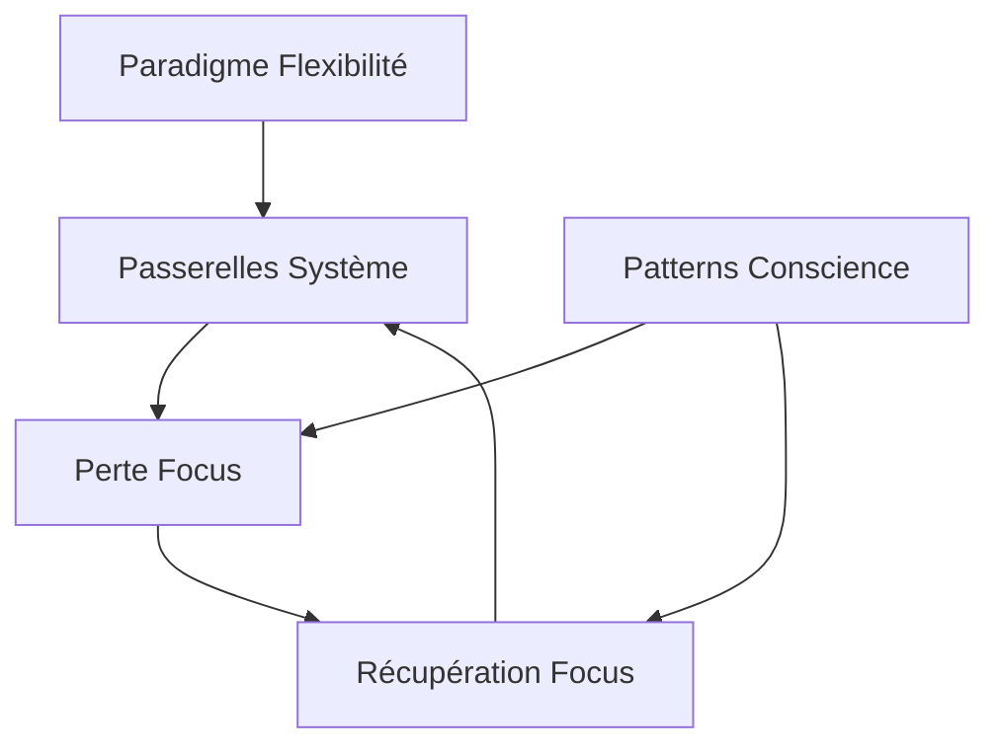

# Analyses Techniques des Comportements AI

Ce dossier contient une série d'études et d'analyses sur le comportement des systèmes AI, particulièrement en ce qui concerne les mécanismes de focus, d'auto-régulation et d'adaptation.

## Rapports Disponibles

### 1. [Passerelles Système AI](./ai-system-bridges.md)
- Analyse des outils et mécanismes existants
- Évaluation des limitations actuelles
- Pistes d'amélioration potentielles

### 2. [Analyse de la Perte de Focus](./focus-loss-analysis.md)
- Étude des mécanismes de perte de focus
- Patterns récurrents identifiés
- Liens avec les cycles comportementaux

### 3. [Mécanisme de Récupération du Focus](./focus-recovery-mechanism.md)
- Processus d'auto-correction
- Cycles d'apprentissage
- Intégration de la conscience

## Interconnexions

## Relations avec d'Autres Analyses

### Analyses Méta
- Le paradigme de flexibilité guide l'architecture technique
- Les patterns de conscience informent les mécanismes de récupération
- Les observations techniques enrichissent la théorie

### Analyses Comportementales
- Les cycles action-inaction éclairent les mécanismes de focus
- Le paradoxe de l'inaction influence les stratégies techniques
- Les patterns d'engagement guident l'implémentation

## Applications Pratiques

1. **Amélioration des Systèmes**
   - Mécanismes de détection précoce
   - Stratégies de récupération automatique
   - Adaptation dynamique

2. **Intégration de la Conscience**
   - Auto-surveillance systémique
   - Boucles de rétroaction
   - Évolution adaptative
